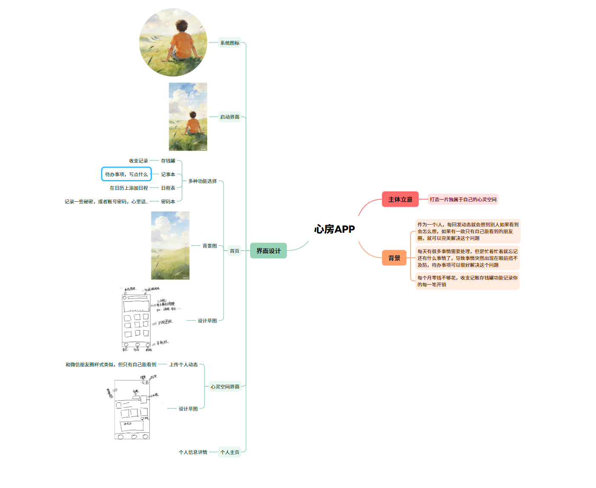
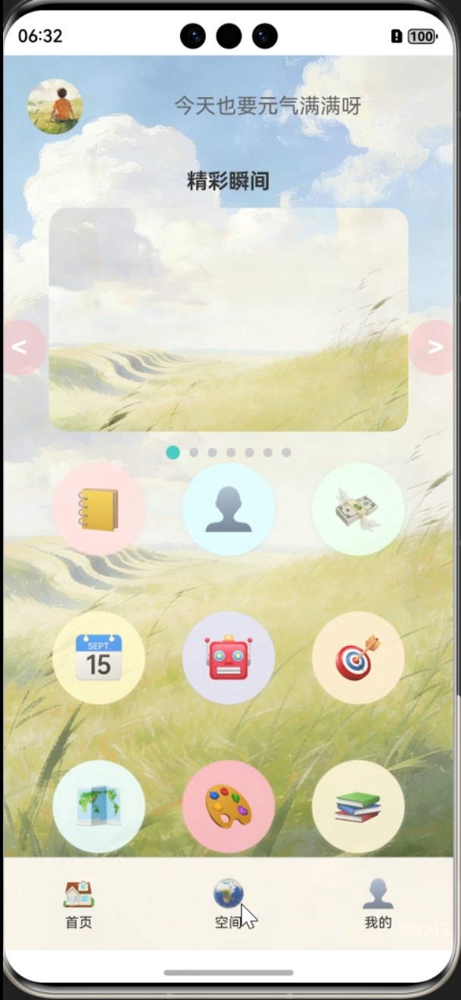
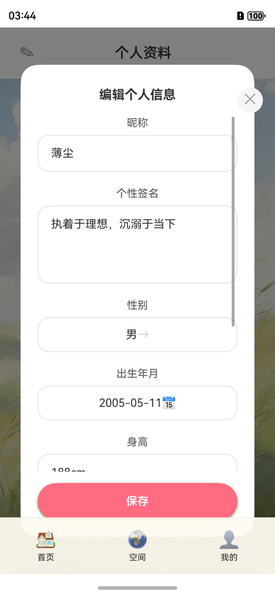
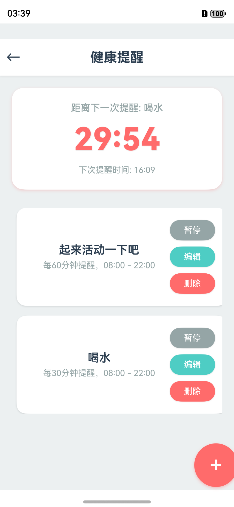
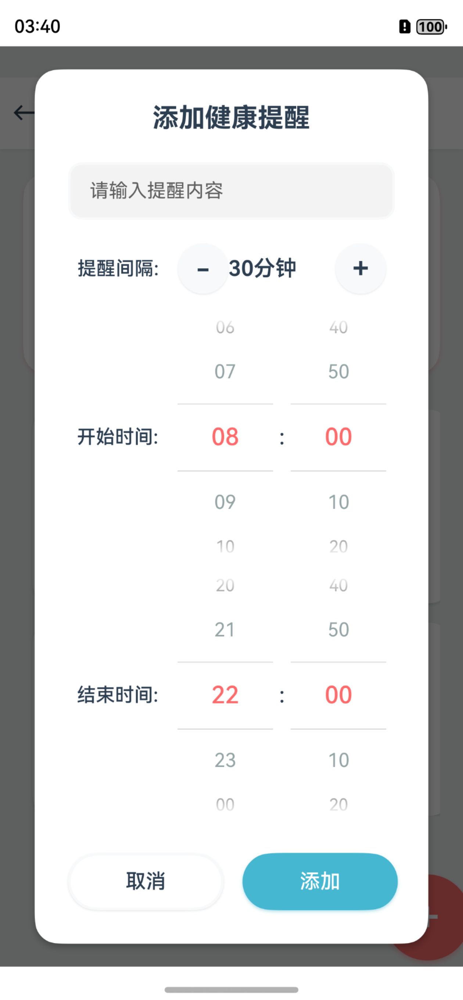
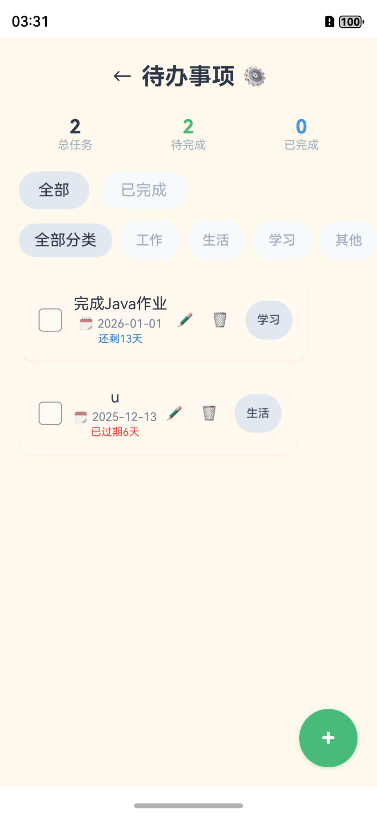
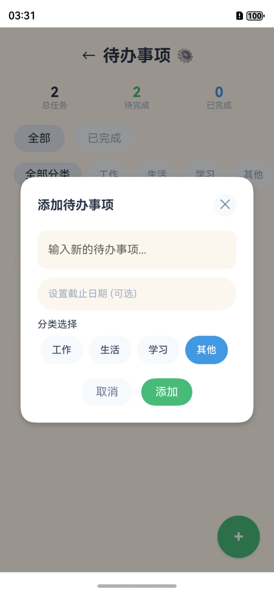
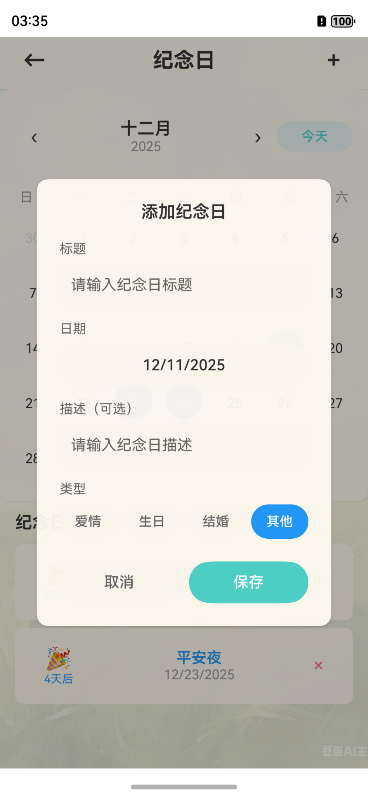
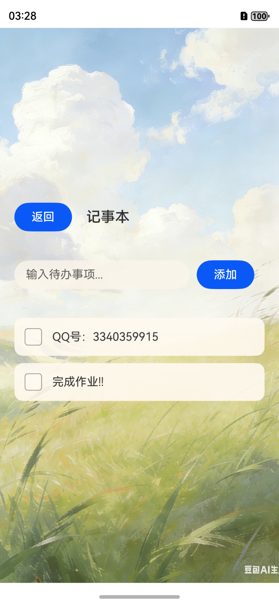
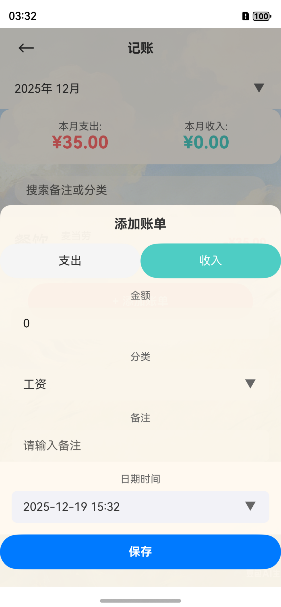

我用夸克网盘给你分享了「hreart_home」，点击链接或复制整段内容，打开「夸克APP」即可获取。
/~99ce3M4F6Y~:/
链接：https://pan.quark.cn/s/892d7eef341d?pwd=65wy
提取码：65wy

基于DevEco的HarmonyOS软件开发

# 应用简介
（一）选题名称
心房：一个独属自己的心灵空间

（二）选题背景
在社交属性愈发凸显的当下，多数社交平台以“公开分享”为核心逻辑，难以适配i人群体内敛、偏好私密表达的需求。以微信朋友圈为例，i人若想记录生活点滴却不愿被他人看见，需手动反复设置“私密可见”，操作繁琐且易遗漏；同时，日常生活中，i人往往需要依赖记事本、待办事项、记账等多种零散工具，频繁切换软件不仅降低效率，也容易造成数据分散、管理不便的困扰。
当前市场上，要么是专注于公开社交的平台，要么是功能单一的工具类软件，缺乏一款能够同时满足i人“私密情感宣泄”与“高效生活管理”双重需求的集成式产品。因此，基于i人群体的核心痛点，设计一款兼具专属私密空间与多功能生活工具的集成软件，具有强烈的现实需求与应用价值。

（三）选题意义
1.  满足i人群体情感需求：为i人打造无压力的私密记录空间，无需顾虑他人眼光，自由留存照片、文字及当时的感受，实现情感的安全宣泄与自我对话；
2.  提升i人生活管理效率：整合多种高频生活小工具，避免多软件切换的繁琐，让记事本、待办事项、记账等功能一站式完成，简化生活管理流程；
3.  填补市场产品空白：打破“社交平台”与“单一工具”的割裂现状，打造适配i人行为习惯的专属产品，为i人群体提供更精准、更贴心的软件服务。
4.  
### 设计意图
本软件的核心设计意图是“以i人为中心，构建‘私密情感+高效生活’的一体化专属空间”，具体可分为以下三个层面：
1.  解决i人私密记录的痛点：针对微信朋友圈私密发布操作繁琐的问题，设计默认私密的个人空间，让i人无需额外设置即可安心记录，同时支持灵活的记录形式，完整留存每一刻的感受与回忆；
2.  实现生活工具的高效集成：考虑到i人对简洁、高效的需求，将日常高频使用的小工具整合于一体，优化工具间的联动性（如待办事项与纪念日关联提醒、记账数据与记事本备注联动等），提升使用便捷性；
3.  营造舒适的个性化使用体验：软件整体风格偏向简约、安静，避免过度社交化的设计元素，同时支持个性化设置（如主题、字体、功能排序等），让i人在使用过程中感受到放松与掌控感，契合其内敛、注重内心感受的性格特质。

## 设计思路

## 首页

## 发布个人动态

## 个人信息

## 其他功能
ai聊天
健康提醒
待办事项
纪念日记录
记事本
记账

